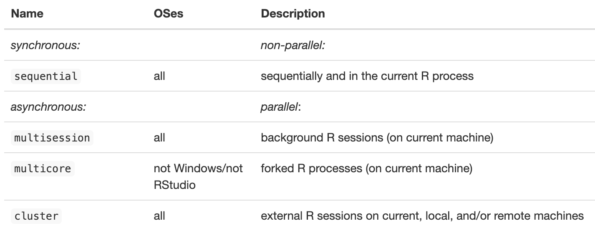

```{r setup, include=FALSE}
knitr::opts_chunk$set(echo = TRUE)

library(future)
library(furrr)

# load in helper functions
source(here::here("R", "fit.R"))

# helper variables
n <- 30  # do leave-one-out for first 30 samples for illustration
```

## Load Data

In this parallelization example, we will be working with gene expression data from women with breast cancer from [The Cancer Genome Atlas (TCGA)](https://www.cancer.gov/ccg/research/genome-sequencing/tcga). In particular, we will be using the gene expressions to predict their breast cancer subtype (Luminal A, Luminal B, Basal, Her2, Normal-like). Let's first load in this data.

```{r load-data}
# load in TCGA breast cancer data
X <- data.table::fread(
  here::here("data", "X_tcga_cleaned.csv"),
  data.table = FALSE
)
y <- data.table::fread(
  here::here("data", "Y_tcga.csv"),
  data.table = FALSE
)[, 1] |>
  as.factor()
```

```{r}
head(X)
```

```{r}
head(y)
```

## Fitting leave-one-out models

For the sake of this demonstration, suppose that we want to evaluate the performance of a random forest model on this data using leave-one-out cross-validation (also known as the jackknife in statistics). To do so, there is a helper function `fit_rf_loo()` that takes in the covariate data `X`, the response variable `y`, and the index of the observation to leave out `i`. This function `fit_rf_loo()` fits a random forest model on the data with the `i`-th observation left out and returns the predicted class of the left-out `i`-th observation.

```{r}
fit_rf_loo
```

## Without Parallelization

Let's first run the leave-one-out cross-validation without parallelization to see how long it takes. We will only run this on the first `n = 30` observations for demonstration purposes.

```{r}
set.seed(242)
start_time <- Sys.time()
preds <- rep(NA, n) # vector of leave-one-out predictions
for (i in 1:n) {
  preds[i] <- fit_rf_loo(i, X, y)
}
end_time <- Sys.time()
execution_time <- end_time - start_time
print(execution_time)
```

## With Parallelization

Next, let's run the leave-one-out cross-validation with parallelization using the `future` package. But before implementing this, let's check how many cores are available on this machine using `future::availableCores()`.

```{r}
availableCores()
```

Now, to parallelize this code, there are two steps:

**Step 1: Setting up the parallel backend.** This is done using the `future::plan()` function, which specifies the parallel backend to use. Here, we will use the multisession backend, which creates multiple (independent) background R sessions to parallelize the computation.

**Step 2: Re-write the code using futures.** A future is an R object that represents the result of an expression that will be evaluated in the future. We can create a future using the `future::future()` function and extract the value of the future using the `future::value()` function.

-   A future can be resolved or unresolved. We can check whether a future is resolved using the `future::resolved()` function.
-   If the value is queried while the future is still unresolved, the current process is blocked until the future is resolved. Otherwise, the code continues to execute (i.e., it's unblocking).

```{r}
set.seed(242)

# set up parallel backend
n_workers <- 2
plan(multisession, workers = n_workers)

start_time <- Sys.time()
futures <- list()
for (i in 1:2) {
# for (i in 1:30) {
  futures[[i]] <- future({
    fit_rf_loo(i, X, y)
  })
  # checking whether the future we created has been resolved or unresolved
  print(resolved(futures))
}
print(paste("Intermediary Time Checkpoint:", Sys.time() - start_time))
preds_future <- lapply(futures, value)
end_time <- Sys.time()
execution_time <- end_time - start_time
print(paste("Final Time Checkpoint:", execution_time))
```

Note:

-   The futures are \`\`non-blocking'' so that the code continues to run (while the futures are being computed in the background) until it reaches a point where the value of the future is needed. This is why the print statement shows that the futures are at first unresolved and the first time check is so quick.
-   The futures are resolved when the `value()` function is called, and the code waits for the future to be resolved before continuing.

Sometimes, it can be more convenient to rewrite the for loop using the `furrr` package, which provides a functional programming interface for parallel programming in R. The `furrr::future_map()` function is similar to the `purrr::map()` function, but it runs the function in parallel using futures.

```{r}
set.seed(242)
plan(multisession, workers = 2)
start_time <- Sys.time()
preds_furrr <- furrr::future_map(
  1:n,
  function(i) {
    fit_rf_loo(i, X, y)
  }#,
  # .options = furrr::furrr_options(seed = TRUE)
)
end_time <- Sys.time()
execution_time <- end_time - start_time
print(execution_time)
```

## Prediction Results

Let's compare the predictions from the non-parallelized, future, and furrr implementations.

```{r}
preds_df <- data.frame(
  i = 1:n,
  non_parallelized = preds,
  future = unlist(preds_future),
  furrr = unlist(preds_furrr)
)
table(preds_df$non_parallelized, preds_df$future)
table(preds_df$non_parallelized, preds_df$furrr)

# prediction accuracy
mean(preds_df$non_parallelized == y[1:n])
table(preds_df$non_parallelized, y[1:n])
```

## Parallelization backends



## Additional Resources/Links

-   **future: <https://future.futureverse.org/articles/future-1-overview.html>**

-   **furrr: <https://furrr.futureverse.org/>**

    -   **Offers drop-in replacements for parallelizing purrr::map() functions**

-   **future.apply: <https://future.apply.futureverse.org/>**

    -   **Offers drop-in replacements for parallelizing base R apply() functions**

-   **doFuture: <https://dofuture.futureverse.org/>**

    -   **The “futureverse” version of the doParallel R package**

Stay up-to-date with the latest developments in the futureverse:\
<https://www.futureverse.org/blog.html>
